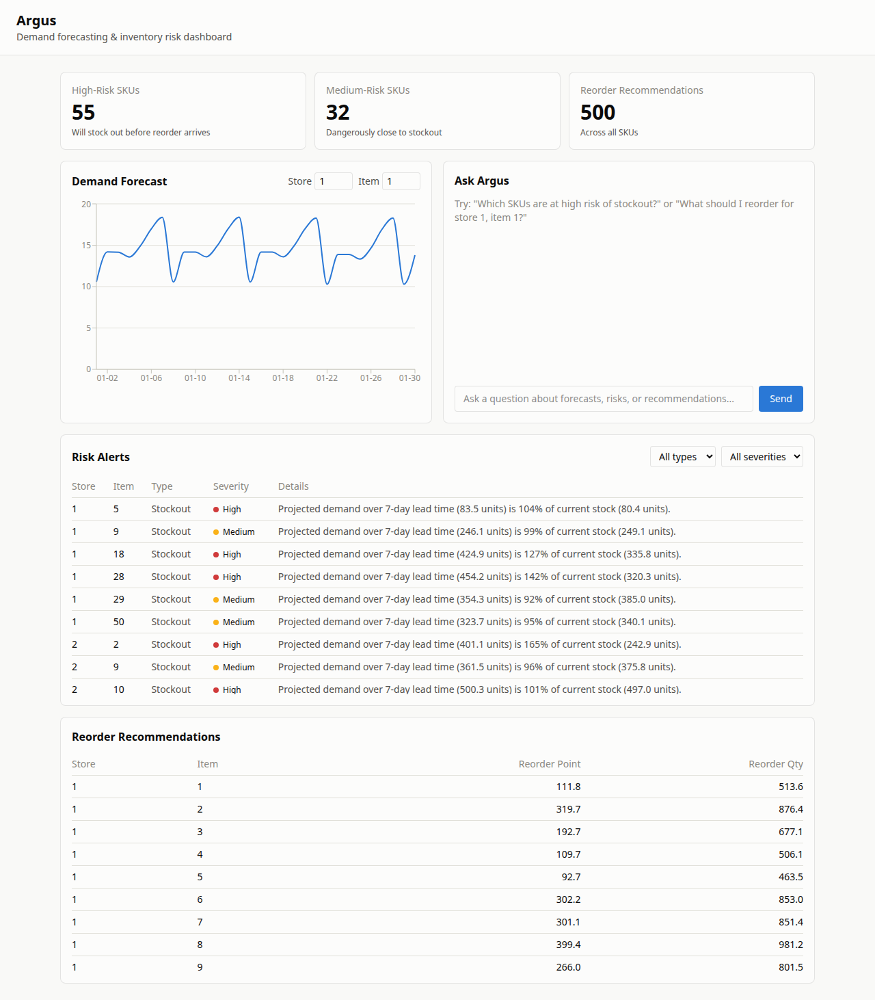

# Argus

Agentic decision-intelligence platform for supply chain demand forecasting and inventory risk management. Enterprises with large product catalogs struggle to quickly answer questions like "which SKUs are about to stock out?" or "what should we reorder, and when?" — Argus ingests historical sales/inventory data, forecasts demand, flags stockout/anomaly risk, recommends reorder actions, and answers natural-language questions about all of it via an LLM agent grounded in that structured output.

Built as a portfolio project for an AI-Analyst role.

## Status

**Build plan complete (Phases 0-10).** The full stack runs as one command locally (`docker compose up -d`), and deployment prep for Render is done — Dockerfiles are Render-compatible (`$PORT` handling, graceful startup with no data yet), plus a `render.yaml` Blueprint and manual step-by-step instructions in the Deployment section below. The actual signup/deploy is a manual step (no way to automate account creation or dashboard clicks), so it's not yet live. Note: the dataset has no real inventory or cost data, so inventory levels and EOQ cost inputs are documented, config-tunable assumptions — see `context.md` for the exact formulas. See `context.md` for the detailed running log and `backlog.md` for known gaps.



## Architecture

```
                     ┌────────────────────┐
                     │      Frontend       │
                     │  React (JavaScript) │
                     │  (Dashboard + Chat)  │
                     └──────────┬───────────┘
                                │ REST (HTTPS)
                     ┌──────────▼───────────┐
                     │      FastAPI          │
                     │   (API Gateway Layer) │
                     └──────────┬───────────┘
                                │
                     ┌──────────▼───────────┐
                     │     Orchestrator       │
                     │  (LangGraph controller)│
                     └───┬────────┬─────┬────┘
                         │        │     │
             ┌───────────▼─┐ ┌────▼───┐ ┌▼────────────┐
             │ Forecast     │ │ Risk /  │ │ Inventory   │
             │ Agent        │ │ Anomaly │ │ Optimization│
             │ (XGBoost/    │ │ Agent   │ │ Agent       │
             │  Prophet)    │ │         │ │ (EOQ calc)  │
             └───────┬──────┘ └────┬────┘ └──────┬──────┘
                     │             │              │
                     └─────────────┼──────────────┘
                                   │  combined output
                     ┌─────────────▼──────────────┐
                     │ Conversational Insight Agent │
                     │  (Groq-hosted Llama/Mixtral,  │
                     │   grounded in agent outputs)  │
                     └─────────────┬──────────────┘
                                   │
                     ┌─────────────▼──────────────┐
                     │        PostgreSQL            │
                     │ (raw data, forecasts, logs)  │
                     └───────────────────────────────┘
```

Deterministic agents (Forecast, Risk, Inventory) run first and produce structured data; the LLM-backed Conversational Agent runs last and only reasons over that structured output — not raw data — to keep answers grounded. See `docs/design_architecture.md` for the full breakdown.

## Tech Stack

Python 3.11+ / FastAPI / LangGraph / XGBoost / PostgreSQL on the backend, React (JavaScript, Vite, Tailwind, Recharts) on the frontend, Groq-hosted open-source LLM for the conversational layer, Docker Compose for local orchestration. Full rationale in `docs/techstack.md`.

## Setup

### One command (recommended)

```bash
git clone <repo-url>
cd argus
cp .env.example .env
# edit .env: set GROQ_API_KEY at minimum

# Dataset: place the Kaggle Store Item Demand Forecasting train.csv
# (https://www.kaggle.com/c/demand-forecasting-kernels-only/data)
# at backend/data/raw/train.csv -- not committed, see .gitignore

docker compose up -d --build
```

That's it — Postgres, the backend (which self-seeds the database and runs the full agent pipeline on first boot only), and the frontend all come up together. App at http://localhost:3000, API directly at http://localhost:8000/docs. First boot takes a few minutes (image build + pipeline seeding); subsequent restarts are fast and skip re-seeding.

### Running services individually (faster iteration during development)

```bash
# Backend: create a virtual environment and install dependencies
cd backend
python3 -m venv argus-venv
source argus-venv/bin/activate
pip install -r requirements.txt
cd ..

# Postgres only
docker compose up -d db

# Create the database tables and load the dataset, then run the full
# deterministic pipeline in one shot via the orchestrator (idempotent)
cd backend
argus-venv/bin/python -c "from app.db.session import init_db; init_db()"
argus-venv/bin/python -m app.services.data_ingestion
argus-venv/bin/python -m app.agents.orchestrator

# Start the API server (docs at http://localhost:8000/docs)
argus-venv/bin/uvicorn app.main:app --reload
```

Run backend tests (DB/schema tests run against in-memory SQLite, no Postgres required):
```bash
cd backend && argus-venv/bin/pytest -v
```

API endpoints: `GET /api/forecasts/{store_id}/{item_id}`, `GET /api/risks`, `GET /api/recommendations`, `POST /api/query` (natural-language question -> grounded answer). Full OpenAPI docs auto-generated at `/docs`.

```bash
cd frontend
npm install
npm run dev   # http://localhost:5173, proxies /api to the backend on port 8000
```

## Deployment (Render)

Deployed to [Render](https://render.com)'s free tier rather than AWS, to avoid billing/account overhead for a portfolio demo. **These steps are manual** — creating an account and clicking through Render's dashboard isn't something that can be automated from here, and Render's exact current UI/free-tier terms should be checked at signup rather than assumed from this doc.

1. **Push this repo to GitHub** if it isn't already (Render deploys from a connected GitHub repo).
2. **Sign up at [render.com](https://render.com)** and connect your GitHub account.
3. **Try the Blueprint first**: in the Render dashboard, "New" -> "Blueprint", pick this repo. Render will read `render.yaml` at the repo root and propose a Postgres database + backend Web Service + frontend Static Site. `render.yaml` is a best-effort file (not verified against the live platform) — if Render flags anything as invalid, fix it directly in the dashboard rather than debugging the YAML blind, or fall back to the manual steps below.
4. **Manual fallback** (or to double-check what the Blueprint created):
   - **Database**: New -> PostgreSQL. Note both its internal and external connection strings once created.
   - **Backend**: New -> Web Service -> this repo -> Docker runtime, Dockerfile path `backend/Dockerfile`, root directory `backend`. Set env vars: `DATABASE_URL` = the database's *internal* connection string, `GROQ_API_KEY` = your key. Render auto-injects `PORT`, which `entrypoint.sh` already respects.
   - **Frontend**: New -> Static Site -> this repo, root directory `frontend`, build command `npm install && npm run build`, publish directory `dist`. Add a rewrite rule: `/api/*` -> `https://<your-backend-service>.onrender.com/api/*` (use the backend's actual assigned URL, visible once it deploys), and `/*` -> `/index.html`.
5. **Seed the database.** The deployed backend only seeds itself if `backend/data/raw/train.csv` is present in its container, which it deliberately isn't (never baked into the image — see `context.md`). Instead, seed Render's Postgres from your own machine using its *external* connection string:
   ```bash
   cd backend
   DATABASE_URL="<external connection string from Render>" argus-venv/bin/python -c "from app.db.session import init_db; init_db()"
   DATABASE_URL="<external connection string from Render>" argus-venv/bin/python -m app.services.data_ingestion
   DATABASE_URL="<external connection string from Render>" argus-venv/bin/python -m app.agents.orchestrator
   ```
   Once seeded, the backend's own `entrypoint.sh` will find existing data on every future boot and skip re-seeding — same idempotent logic as the local Docker Compose flow.
6. Visit the frontend's Render URL to confirm the live deployment.

## Results

**Demand forecast (XGBoost, global model across all 500 store-item combinations)**: 16.79% MAPE on a held-out 30-day window, vs. 24.94% MAPE for a seasonal-naive baseline (predicting each day from the same SKU's actual sales 7 days earlier) — roughly a third lower error than a reasonable, non-trivial baseline. Evaluated on a strict temporal holdout (trained only on data before the held-out window, never a random shuffle-split, which would leak future information). See `context.md` for the full methodology.

**Risk detection**: 87 of 500 SKUs flagged for stockout risk (55 high severity — will run out before a reorder could arrive; 32 medium — dangerously close), driven by the synthesized inventory's cover range against a 7-day lead time. 0 SKUs flagged as demand anomalies for the most recent week — independently verified as a genuine result (max z-score 1.61 against a 2.5 threshold, computed via a standalone diagnostic), not a silent detection failure.

**Inventory recommendations**: reorder point and EOQ-based reorder quantity computed for all 500 SKUs via standard safety-stock and EOQ formulas (see `context.md` for the exact formulas and the documented cost-input assumptions, since the dataset has no real price data).

**Conversational queries** (Groq, `llama-3.3-70b-versatile`, via LangChain tool-calling): verified against the real API for all 3 required query types (risk/forecast/recommendation), each resolving in exactly 1 tool call with answers matching the underlying data exactly (e.g. "what's the forecast for store 1 item 1 on 2018-01-05" -> "14.9 units", matching the DB row). Along the way, hit and fixed the exact LLM tool-calling reliability risk flagged in `docs/PRD.md` — see `context.md` for the bug and fix.

**Dashboard**: verified with a real headless-browser run (Playwright) against the live stack — screenshotted in both light and dark mode, including a full chat round-trip against the real Groq API, with zero browser console errors. See screenshot above.

**Full-stack Docker**: `docker compose up -d --build` verified end-to-end — self-seeding backend, nginx-proxied frontend, headless-browser screenshot of the fully containerized app identical to the dev-server version.

## Project docs

- `docs/PRD.md` — product requirements
- `docs/SRS.md` — functional/non-functional requirements
- `docs/design_architecture.md` — architecture detail and design rationale
- `docs/techstack.md` — tech choices and why
- `docs/style_guide.md` — code style and conventions
- `context.md` — running build log (read this for full current state)
- `backlog.md` — pending work and known gaps
